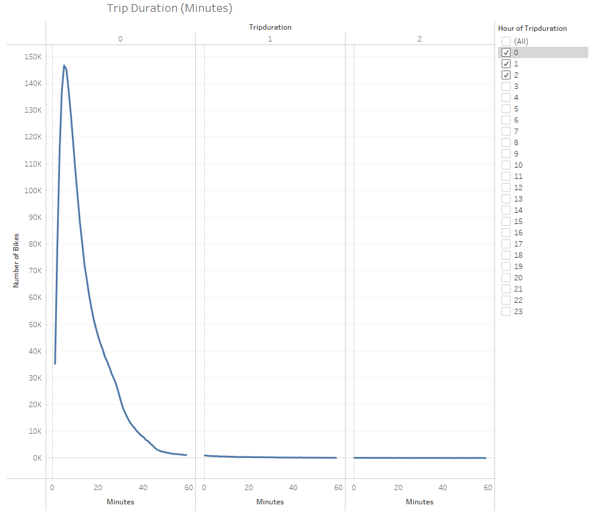

# Bike Sharing
## Overview

## Results
 
The majority of bike are rented for 20 minutes or less, with the most common trip time being 5 minutes. Very few rides last longer than 60 minutes. 

 
Women tend to rent bikes more often than men but both genders seem to follow a similar trend as far as length of trip, with the most common length being 5 minutes and 6 minutes respectively. 

 
The most frequently used starting points seem to be centered around Manhattan, suggesting a higher demand for public transportation in this area. 

 
Far more subscribers than one-time users, which provides a steady revenue source. Women use the bikes more often every day of the week vs men. 

 
This graph shows that bikes are rented for a normal workday commute, with the peak hours being 8 -9 am and 5-7pm, Mon-Fri. They are also very popular for weekend leisure activities with Saturday being the busiest day for rentals.

 
 
This graph reflects the previous one, broken up by gender with women renting more bikes than men. 

## Summary 
